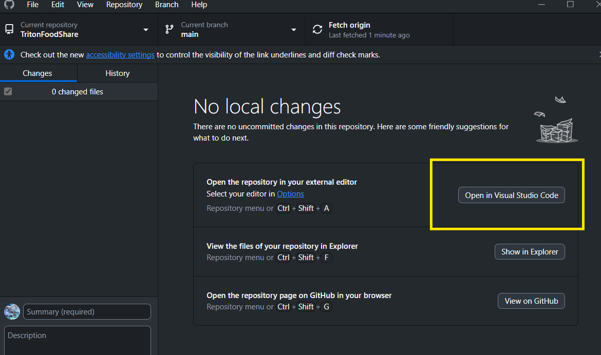

# TritonFoodShare

Welcome to TritonFoodShare, an app created as our project in UCSD CSE 110. 

> Many UCSD organizations often struggle to distribute leftover food after events while many students are in search of affordable or free food options on campus. Our app, 'Triton FoodShare,' bridges this gap by allowing organizations to submit details about leftover food, including ingredients, photos, and locations. Students can then easily access these available food options and filter them by dietary restrictions and proximity, making it easier to find food that meets their needs while also reducing food waste on campus

## Features

### MVP Features

1. Form Module

    - Allow organizations to submit forms that detail their events with leftover food to allow students to find them. 
    
    - These forms will contain details such as descriptions of food, pictures, location description, time, dietary restrictions, etc. 
    
    - The organization will have the ability to delete the event early if food runs out.

2. Display Events Tab

    - Allow users to see a list of events being held with all relavent information submitted by the hosting organization.

### 100% Features

1. Manual Preference Filter

    - Be able to filter events via certain criteria such as location, time, and food types (dietary restrictions).

2. Counter Button

    - Be able to click a counter to signify that you are attending/planning to attend an event.

    - This lets both other users and hosts to be aware of how many people to expect.

3. Query for Location

    - Include an embedded google map link location api to allow organizations to precisely guide users to their location.

### Optional Features

1. Embedded Map

    - Include an embedded map to allow users to see where events are being held.

2. Accounts

    - Allow users to make accounts that save their relavent information such as their dietary restrictions, which then allow for automatic filtering.

3. UCSD Email Verification

    - Ensure that all attendees are UCSD verified by using their UCSD emails.

4. Report Tool

    - Allow users to report spam or malicious content, which will then be handled manually by an admin.

## Getting started?

Here's how to start running this code.

1. Download the code and open the code in your local code editor

    - Click the green <> Code button

    

    - Open with GitHub Desktop

    

    - Open the code in your preferred editor

    

2. Make sure node.js is installed on your computer

    - Go to this google doc and follow the Setup instructions if you don't have node.js installed
    
        [CSE 110 Lab 2 Node JS Setup](https://docs.google.com/document/d/1eU8T8CMZNZdk5cOV3j_vbdnKiCvUV_5z78cidBMFsrQ/edit?tab=t.0#heading=h.m9dn6lewta1m)

    - To make sure you have node.js installed, in your terminal, run `npm -v`

3. Change directory into **my-app/client** by running `cd my-app/client` in the terminal

4. Run `npm install` to download all required packages to run this node.js server

    - If you are encountering an error message such as:
    > s1 cannot be loaded because running scripts is disabled on this system. For more informationm see about_Execution_Policies at http://go.microsoft.com/fwlink/?LinkID=135170.
    
    Try running:
    
    `Set-ExecutionPolicy -Scope CurrentUser -ExecutionPolicy Unrestricted`

    Solution found from [stackoverflow](https://stackoverflow.com/questions/41117421/ps1-cannot-be-loaded-because-running-scripts-is-disabled-on-this-system)

5. Run `npm start` to start the react server. 

    - Your local app will be found at **localhost:3000** if not automatically opened in a new browser

    

